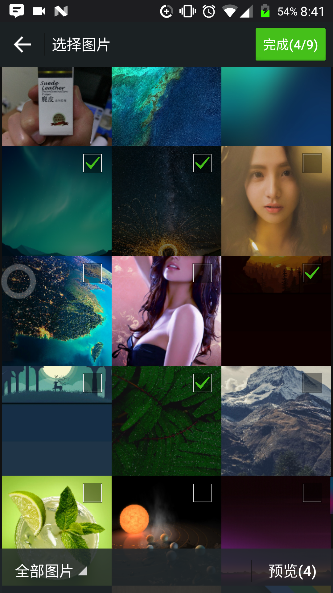
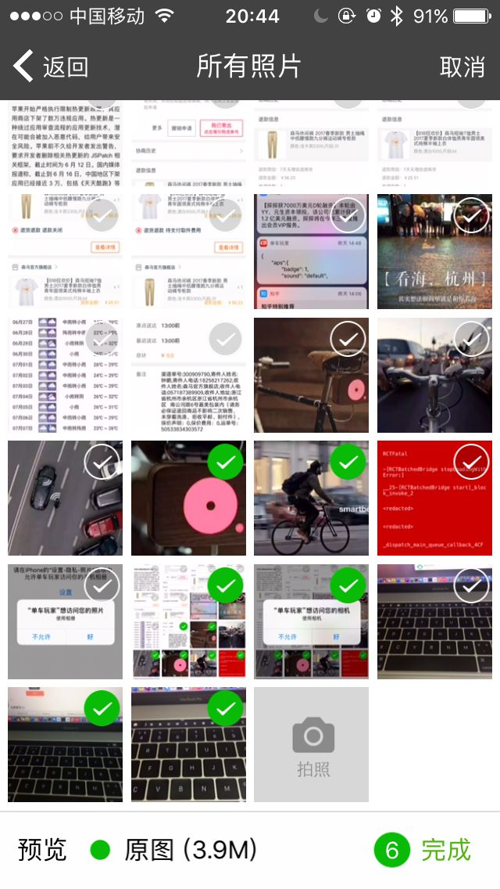

# cordova-plugin-ImagePicker

非常感谢[南尘](https://github.com/nanchen2251)和 [banchichen](https://github.com/banchichen) 提供的源码支持 多点star✨开源不容易，谢谢。扣扣群：273613165

一个支持多选，相册实现了拍照、预览、（Android 图片压缩）等功能

## 功能

- 相册目录
- 多选图
- 相册内部拍照
- 预览选中的图片
- 图片压缩（Android）

## 安装要求

- Cordova Version >=5.0
- Cordova-Android >=4.0
- Cordova-iOS >=6.0

## iOS Requirements 要求

OS 6 or later. Requires ARC iOS6及以上系统可使用. ARC环境.

When system version is iOS6 or iOS7, Using AssetsLibrary. When system version is iOS8 or later, Using PhotoKit. 如果运行在iOS6或7系统上，用的是AssetsLibrary库获取照片资源。 如果运行在iOS8及以上系统上，用的是PhotoKit库获取照片资源。

## 安装

 - `cordova plugin add https://github.com/giantss/cordova-plugin-ImagePicker.git`


注意：Android 项目先不要直接 build ，见 [android注意事项](#android注意事项)。

## Android 视频演示

- [点击查看视频(mp4格式)](http://oqdxjvpc7.bkt.clouddn.com/111.mp4)<br>
- [点击查看视频(优酷)](http://v.youku.com/v_show/id_XMjg0NDg0NDIyMA==.html)

## iOS 视频演示

- [点击查看视频(mp4格式)](http://oqdxjvpc7.bkt.clouddn.com/ios1.mp4)<br>
- [点击查看视频(优酷)](http://v.youku.com/v_show/id_XMjg0NDg0NTU4OA==.html)

## 效果图

| Android         | iOS          |
|:---------------:|:------------:|
|  |  |

## 使用方式

### 注：目前下面demo中传入的参数都可以不传，程序默认会设置下面demo的传参数，如果需要传参数，都得一起传，`一个都不能少`，否则会报json错误。

```javascript
ImagePicker.getPictures(function(result) {
    alert(result);
}, function(err) {
    alert(err);
}, { maximumImagesCount : 9, width : 1920, height : 1440, quality : 100 });
```

## 参数含义

| 配置参数            | 参数含义                   |
|:------------------:|:-------------------------:|
| maximumImagesCount | 多选限制数量，默认为9        |
| width              | 设置图片的width，默认为1920   |
| height             | 设置图片的height，默认为1440  |
| quality            | 图片质量 默认100            |

## android注意事项

### 缺少 provider_paths.xml 文件问题

出现下面错误
```
Error: /Users/guodapeng/Documents/Cordova/skateboard/platforms/android/gradlew: Command failed with exit code 1 Error output:
/Users/guodapeng/Documents/Cordova/skateboard/platforms/android/build/intermediates/manifests/full/debug/AndroidManifest.xml:66:35-54: AAPT: No resource found that matches the given name (at 'resource' with value '@xml/provider_paths').
```
将 cordova-plugin-ImagePicker/src/android/res/xml/ 目录的 provider_paths.xml 文件复制到 platforms/android/res/xml/ 目录下

### 插件选图闪退问题
在安装了扫描二维码插件时，在 patient-barcodescanner.gradle 文件中将 support-v4 修改为下面版本，可以解决闪退问题。
```
com.android.support:support-v4:25.3.1
```

## License

[The MIT License (MIT)](http://www.opensource.org/licenses/mit-license.html)
