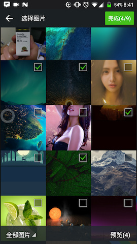
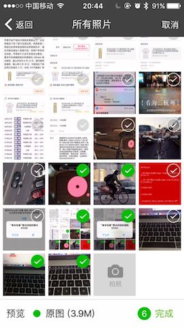

# cordova-plugin-ImagePicker

非常感谢[南尘](https://github.com/nanchen2251)和 [banchichen](https://github.com/banchichen) 提供的源码支持 多点star✨开源不容易，谢谢。扣扣群：273613165

一个支持多选，相册实现了拍照、预览、图片压缩等功能

## 功能

- 相册目录
- 多选图
- 相册内部拍照
- 预览选中的图片
- 图片压缩

## 安装要求

- Cordova Version >= 6.0.0
- Cordova-Android >= 6.0.0
- Cordova-iOS >= 4.0.0

## iOS Requirements 要求

OS 6 or later. Requires ARC iOS6及以上系统可使用. ARC环境.

When system version is iOS6 or iOS7, Using AssetsLibrary. When system version is iOS8 or later, Using PhotoKit. 如果运行在iOS6或7系统上，用的是AssetsLibrary库获取照片资源。 如果运行在iOS8及以上系统上，用的是PhotoKit库获取照片资源。

## 安装

 - `cordova plugin add https://github.com/giantss/cordova-plugin-ImagePicker.git`


注意：Android 项目先不要直接 build ，见 [android注意事项](#android注意事项)。

## Android 视频演示

- [点击查看视频(mp4格式)](http://oqdxjvpc7.bkt.clouddn.com/111.mp4)<br>
- [点击查看视频(优酷)](http://v.youku.com/v_show/id_XMjg0NDg0NDIyMA==.html)

## iOS 视频演示

- [点击查看视频(mp4格式)](http://oqdxjvpc7.bkt.clouddn.com/ios1.mp4)<br>
- [点击查看视频(优酷)](http://v.youku.com/v_show/id_XMjg0NDg0NTU4OA==.html)

## 效果图

| Android         | iOS          |
|:---------------:|:------------:|
|  |  |

## 使用方式
[一个粗糙的 cordova demo](https://github.com/giantss/ImagePickerDemo)

```javascript
ImagePicker.getPictures(function(result) {
    alert(JSON.stringify(result));
}, function(err) {
    alert(err);
}, { 
    maximumImagesCount : 9, 
    width : 1920, 
    height : 1440, 
    quality : 100 
});
```

返回结果如下：
```json
{
    "images": [
        "/storage/emulated/0/com.ruguoapp.jike/jikeImg/jike_1526912081333_pic.gif", 
        "/data/user/0/com.pushsoft.imagepicker/cache/ImagePicker/1526957362446190.jpg", 
        "/data/user/0/com.pushsoft.imagepicker/cache/ImagePicker/1526957362520245.jpg", 
        "/data/user/0/com.pushsoft.imagepicker/cache/ImagePicker/152695736256873.jpg"
    ],
    "isOrigin": false // 是否原图
}
```

## 参数含义

| 配置参数            | 参数含义                   |
|:------------------:|:-------------------------:|
| maximumImagesCount | 多选限制数量，默认为9        |
| width              | 设置图片的width，默认为1920   |
| height             | 设置图片的height，默认为1440  |
| quality            | 图片质量 默认80            |

### 注意：

- 参数都是可选的，不传则使用默认值；
- 如果 width > 0 且 height > 0：Android 下压缩的图可能比原图大或者压缩率不高（比如原图4MB，压缩后也有2MB），可以 quality 设置低一些，比如 50；iOS 下会忽略 quality 参数；
- 如果 width < 0 或 height < 0：那么插件返回压缩图，压缩逻辑接近于微信，自动选取合适的分辨率和压缩品质，推荐使用这种方式。压缩库使用的是 [Luban](https://github.com/Curzibn/Luban) 和 [Luban-iOS](https://github.com/GuoZhiQiang/Luban_iOS)。如果遇到压缩不清晰等问题，请到他们的项目上提 issues；
- 运行时，选图界面上有“原图”单选按钮，选上之后，返回的图片是未压缩的原图

## android注意事项

- 先移除安装过的旧版插件

- 如果 build 报下面的错
    ```
    error: resource android:attr/dialogCornerRadius not found
    error: resource android:attr/fontVariationSettings not found
    error: resource android:attr/ttcIndex not found
    ```

    请使用 [cordova-android-support-gradle-release](https://github.com/dpa99c/cordova-android-support-gradle-release) 这个插件统一项目中的 Android Support 库版本：
    ```
    $ cordova plugin add cordova-android-support-gradle-release  --variable ANDROID_SUPPORT_VERSION={required version}
    ```
    其中`{required version}` 值为类似 `25.+`，`26.+`，`27.+` 这种。

- 如果还是 build 不成功
    ```
    $ cordova platform rm android
    ```
    或
    ```
    $ cordova platform rm ios
    ```
    移除旧的平台，然后重新 add


## 参考项目

### 多选图片项目
- [nanchen2251/ImagePicker](https://github.com/nanchen2251/ImagePicker) (Android)
    - [jeasonlzy/ImagePicker](https://github.com/jeasonlzy/ImagePicker)
- [banchichen/TZImagePickerController](https://github.com/banchichen/TZImagePickerController) (iOS)

### 图片压缩库
- [nanchen2251/CompressHelper](https://github.com/nanchen2251/CompressHelper) (Android)
- [Curzibn/Luban](https://github.com/Curzibn/Luban) (Android)
- [GuoZhiQiang/Luban_iOS](https://github.com/GuoZhiQiang/Luban_iOS) (iOS)

## 更新说明

### v1.1.1

- (Android)适配 Cordova@8、Cordova-Android@7
- (Android)provider_paths.xml 改名，FileProvider 改名，不会与其他插件冲突，也不需要手动复制到 cordova/platform/android/res/xml/ 下
- (Android)去除 styles.xml，改成在代码中设置样式，避免与其它插件也有这个同名的文件导致冲突
- (Android)Glide 图片库更新到最新，支持 Gif，性能大幅提升，应该没有图片墙显示不出预览图的问题了
- (Android)图片墙底栏上增加“原图”单选按钮
- (iOS)修正 iOS 勾选原图是，返回的图不是原图，以及压缩图比原图大的问题
- maximumImagesCount、width、height 等参数可选传递
- 如果 width < 0 且 height < 0，则自动选取合适的分辨率和压缩比进行压缩，接近于微信的压缩逻辑
- 修改成功回调的返回参数，原来返回图片路径数组 `['xxx', 'yyy']`，现在是 `{ images: ['xxx', 'yyy'], isOrigin: true/false }`


## License

[The MIT License (MIT)](http://www.opensource.org/licenses/mit-license.html)


