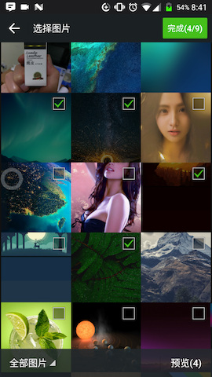

# cordova-plugin-ImagePicker

Muito obrigado [South dust] (https://github.com/nanchen2251) e [banchichen] (https://github.com/banchichen) suporte de código-fonte para a estrela multi-estrelas O código aberto não é fácil, obrigado. Grupo de fivelas de botões: 240255635

Uma escolha múltipla de suporte, álbum de fotos para alcançar uma foto, visualização, (compressão de imagem do Android) e outras funções

## Funções

- Diretório do álbum
- Escolha mais fotos
- Foto interna do álbum de fotos
- Visualizar a imagem selecionada
- Compressão de imagem (Android)

## Requisitos de instalação

- Cordova Version> = 5.0
- Cordova-Android> = 4.0
- Cordova-iOS> = 6.0

## iOS Requisitos de requisitos

OS 6 ou posterior. Requer ARC disponível para iOS6 e acima. Ambiente ARC.

Quando a versão do sistema é iOS6 ou iOS7, Usando a AssetsLibrary. Quando a versão do sistema é iOS8 ou posterior, usando o PhotoKit. Se estiver executando no sistema iOS6 ou 7, use a biblioteca AssetsLibrary para obter recursos de fotos. Se estiver executando no iOS8 e acima, use a biblioteca PhotoKit para obter os recursos da foto.

## instalação

1. Linha de comando `plugin cordova adicionar https: // github.com / gigantes / cordova-plugin-ImagePicker.git`
2. Execute `cordova build --device` a partir da linha de comando

Nota: o projeto do Android primeiro não cria diretamente, veja [nota do Android] (# nota do Android).

# Demo de video do Android

[Clique para ver o vídeo (formato mp4)] (http://oqdxjvpc7.bkt.clouddn.com/111.mp4) <br>
[Clique para ver o vídeo (Youku)] (http://v.youku.com/v_show/id_XMjg0NDg0NDIyMA==.html)

## iOS Video Demo

[Clique para ver o vídeo (formato mp4)] (http://oqdxjvpc7.bkt.clouddn.com/ios1.mp4) <br>
[Clique para ver o vídeo (Youku)] (http://v.youku.com/v_show/id_XMjg0NDg0NTU4OA==.html)

## Renderizando

| Android         | iOS          |
|:---------------:|:------------:|
|  |  |

## Use

### Nota: Os seguintes parâmetros passados na versão demo não podem ser aprovados, o programa padrão definirá os seguintes parâmetros de aprovação de demonstração, se você precisar passar parâmetros, deve passar juntos, 'não pode ser menos ', ou o erro do json será reportado .

```javascript
ImagePicker.getPictures(function(result) {
    alert(result);
}, function(err) {
    alert(err);
}, { maximumImagesCount : 9, width : 1920, height : 1440, quality : 100 });
```

## Explicação dos Parâmetros

Parâmetros de Configuração | Parâmetro Significado
-------------------------- | ----------------------------------------------------
maximumImagesCount         | Multi-select o número de restrições, o padrão é 9   
width                      | Definir a largura da imagem, o padrão é 1920
height                     | Define a altura da imagem, o padrão é 1440
quality                    | Qualidade da imagem padrão 100

## Android Notas

### faltando colors.xml, problema do arquivo provider_paths.xml
Ocorreu o seguinte erro
```
Error: /Users/guodapeng/Documents/Cordova/skateboard/platforms/android/gradlew: Command failed with exit code 1 Error output:
/Users/guodapeng/Documents/Cordova/skateboard/platforms/android/res/drawable/selector_back_press.xml:4:29-46: AAPT: No resource found that matches the given name (at 'drawable' with value '@color/theme_body').
```
Copie o arquivo colors.xml do diretório cordova-plugin-ImagePicker/src/android/res/values/ para platforms/android/res/values/

Ocorreu o seguinte erro
```
Error: /Users/guodapeng/Documents/Cordova/skateboard/platforms/android/gradlew: Command failed with exit code 1 Error output:
/Users/guodapeng/Documents/Cordova/skateboard/platforms/android/build/intermediates/manifests/full/debug/AndroidManifest.xml:66:35-54: AAPT: No resource found that matches the given name (at 'resource' with value '@xml/provider_paths').
```
Copie o arquivo provider_paths.xml do diretório cordova-plugin-ImagePicker/src/android/res/xml/ para platforms/android/res/xml/
### problema de seleção de mapa de recuperação flash plug-in
Ao instalar o plug-in de código QR, você pode contornar o problema de flashback alterando o suporte-v4 para a seguinte versão no arquivo patient-barcodescanner.gradle.
```
com.android.support:support-v4:25.3.1
```

## Licença

[A Licença MIT (MIT)] (http://www.opensource.org/licenses/mit-license.html)
